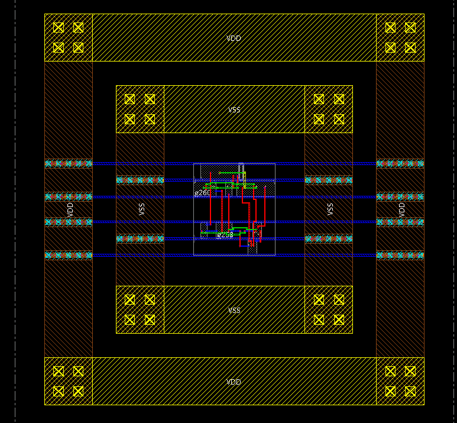

EDA Tool Test @ Univ. of Aizu
========

This repo consists of a Moore FSM code for detecting "110" written in VHDL and Verilog HDL.
Simulation script using ModelSim is include
Synthesis (using Cadence Genus) and layout using (Cadence Innous) scripts and results are included.

prerequisite
-------------

- Modelsim
- Cadence Genus
- Cadence Innovus
- Nangate 45nm library

RTL code
--------

The register transfer level code of a FSM is decoder110.vhd or decoder.v on the ```rtl``` folder.

Simulation
---------

To simulate, open ModelSim and change the directory to the ```simulation``` folder.
Run ```do sim_VHDL.do``` to run the VHDL model.
Or Run ```do sim_VHDL.do``` to run the verilog model.

Synthesis
---------

Open Cadence Genus. Change to the ```synthesis``` folder

``` source decoder110_vhdl.tcl```
or
``` source decoder110_verilog.tcl```

Reports and outputs can be founded in the ```synthesis``` folder.


Place and router
---------

Open Cadence Innovus. Change to the ```place-and-route``` folder

``` source decoder110.tcl```

Reports and outputs can be founded in the ```place-and-route``` folder.


Result
---------

#### Timing

Period: 2.4 ns
Arrival at 1.379 ns
Slack: 1.021 ns
Result: passed timing

#### Area

9 gates.
2 DFFs => 4 states for S0, S1, S2, and S3
State moves steadily => 1 Half adder is used

#### Layout

Only ultilze 60%

The final layout for NANGATE 45nm 



Contact
------

Khanh N. Dang
khanh@u-aizu.ac.jp
